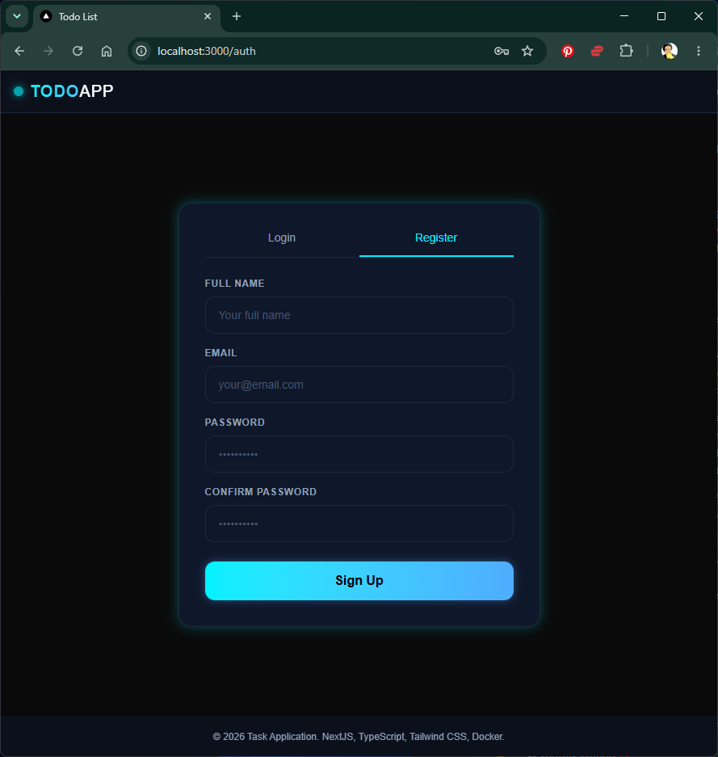
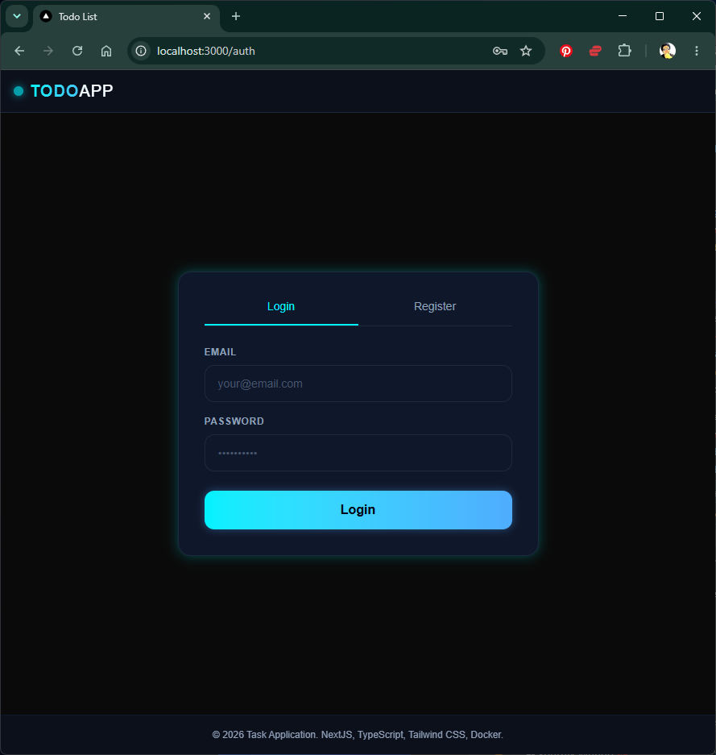
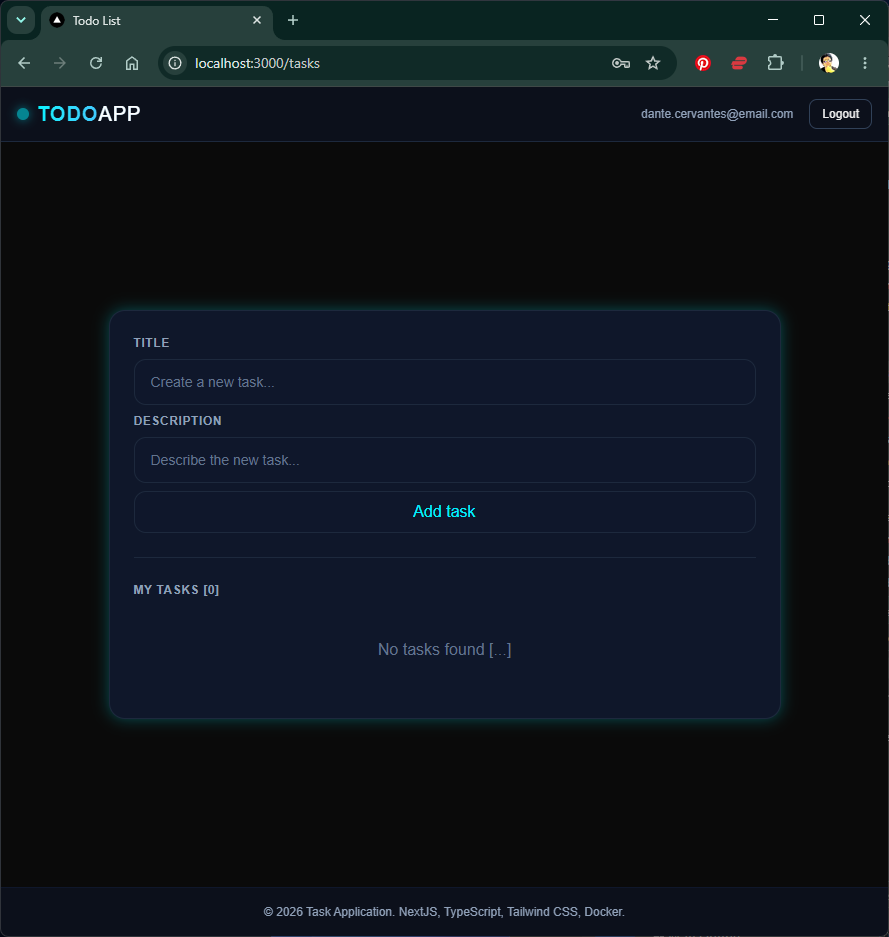
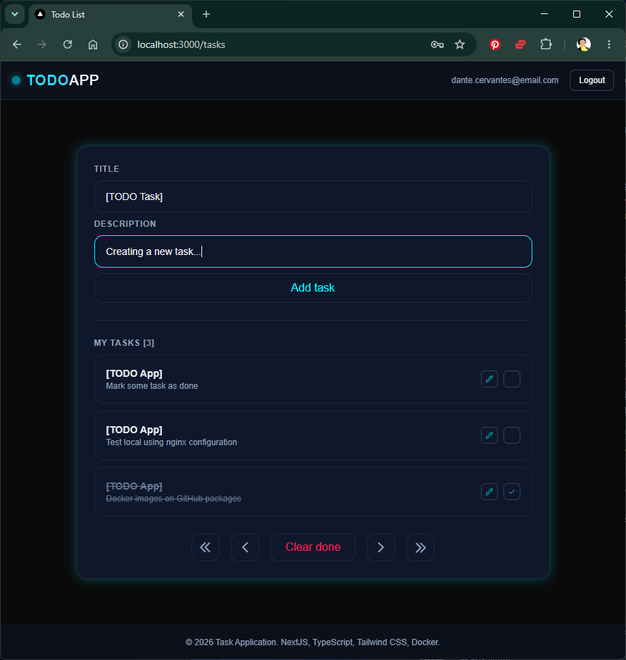
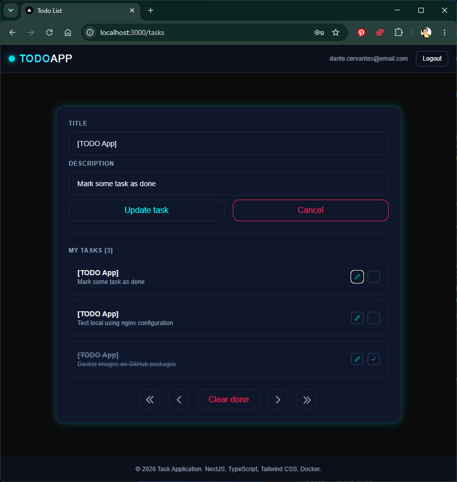

# To Do (Microservices)

## Justification

- Frontend responsive with tailwindcss 
- Backend development with NestJS
- Microservices architecture and containers production ready
- SQL DB migrations
- JWT authentication and Cookies for session management
- NGINX for reverse proxy
- Production-ready configuration

## Run

### Start

```bash
docker compose up -d
```

### Access

```bash
http://localhost:3000
```

### Stop

```bash
docker compose down
```

## Captures

<table>
  <tr>
    <td>
      
    </td>
    <td>
      
    </td>
  </tr>
  <tr>
    <td>
      
    </td>
    <td>
      
    </td>
  </tr>
  <tr>
    <td>
      
    </td>
  </tr>
</table>

## Tech Stack

<table>
  <tr>
    <td>
      <strong><i>Frontend</i></strong>
    </td>
    <td>
      Next.js, React, TypeScript, TailwindCSS
      <br>
      
    </td>
  </tr>
  <tr>
    <td>
      <strong><i>Backend</i></strong>
    </td>
    <td>
      NestJS, Sequelize, TypeScript, Yarn
      <br>
      
    </td>
  </tr>
  <tr>
    <td>
      <strong><i>Test</i></strong>
    </td>
    <td>
      Jest
      <br>
      
    </td>
  </tr>
  <tr>
    <td>
      <strong><i>Database</i></strong>
    </td>
    <td>
      Sequelize, PostgreSQL, SQLlite
      <br>
      
    </td>
  </tr>
  <tr>
    <td>
      <strong><i>Deployment</i></strong>
    </td>
    <td>
      Docker, NGINX, GitHub
      <br>
      
    </td>
  </tr>
</table>

## Contact info

<table>
  <tr>
    <td>
      
    </td>
    <td>
      
    </td>
    <td>
      <strong>Dante Cervantes</strong><br>
      <sub>Software Engineer</sub><br>
       •
      <a href="https://github.com/voncerbau">GitHub</a> •
      <a href="https://linkedin.com/in/cervantesdante">LinkedIn</a> •
      <br>
      dante.cervantes.b@gmail.com
    </td>
  </tr>
</table>
